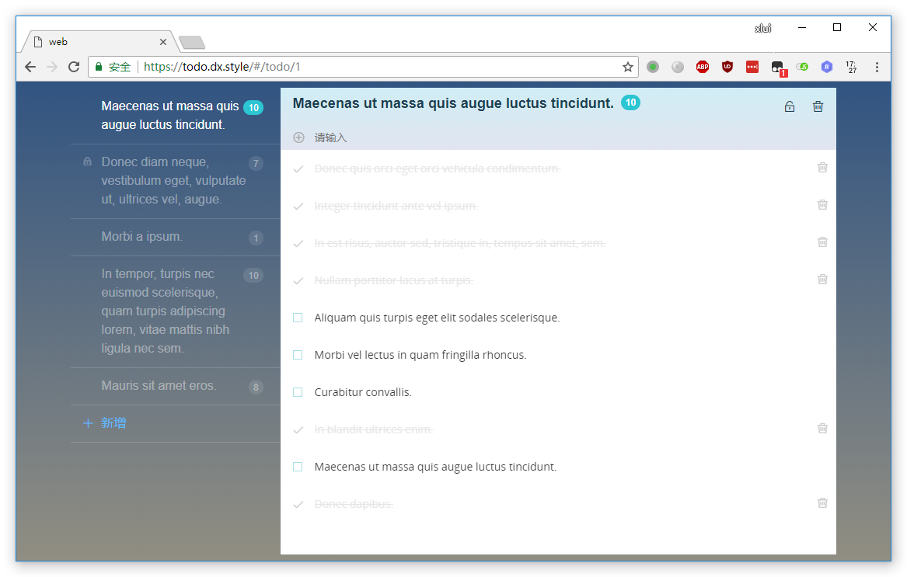

# Easy-Todo

[](https://github.com/xlui/Easy-Todo)

A simple todo application based on [Vue](https://github.com/vuejs/vue) and [Flask](https://github.com/pallets/flask).

preview: https://todo.dx.style

## About this project

[Vue.js](https://github.com/vuejs/vue) is a excellent open source project, and I have learnt Vue.js in the winter of 2017. But after learning about how to use Vue(the grammar of Vue.js), I'm still not sure where to use it. Recently I hit on an open source project [vue-todos](https://github.com/liangxiaojuan/vue-todos) which teaches how to use Vue.js to write a simple Todo application.

The project uses `mockjs` to simulation data, and in this project, we will provide a [Flask](https://github.com/pallets/flask) based backend.

This project is licensed under [MIT](LICENSE) and the origin project is licensed under `All rights reserved`.

## Preview




As you can see, that is responsive layout.

## How to run

In order to run this project, first download the project:

```bash
git clone https://github.com/xlui/Easy-Todo
cd Easy-Todo
```

Run the server:

```bash
cd server
pip install -r requirements.txt
python manage.py runserver
```

Run Vue:

```bash
cd web
npm install
npm run dev
```

## How to deploy

In order to deploy it to server, also download it from github first:

```bash
git clone https://github.com/xlui/Easy-Todo
cd Easy-Todo/
```

For the python server, use gunicorn:

```bash
cd server/
pip install gunicorn
gunicorn -w 2 -b 127.0.0.1:5000 wsgi:app
```

You can also use supervisor to control your server app.

And use Nginx to do reversed proxy:

```nginx
location /api {
    proxy_pass http://127.0.0.1:5000/;
    proxy_redirect off;
    proxy_set_header    Host                $host;
    proxy_set_header    X-Real-IP           $remote_addr;
    proxy_set_header    X-Forwarded-For     $proxy_add_x_forwarded_for;
    proxy_set_header    X-Forwarded-Proto   $scheme;
}
```

For the vue front-end, you just need to package it and deploy to the web root:

```bash
cd web/
npm run build
rm -rf /path/to/webroot/*
cp -r dist/* /path/to/webroot
```